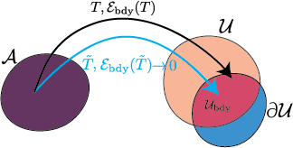
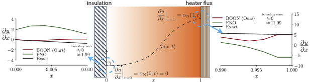
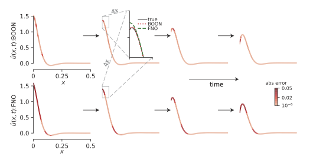

# BOON: Boundary correction for neural operators



[Nadim Saad*](https://profiles.stanford.edu/nadim-saad), [Gaurav Gupta*](http://guptagaurav.me/index.html), [Shima Alizadeh](https://scholar.google.com/citations?user=r3qS03kAAAAJ&hl=en), [Danielle C. Maddix](https://scholar.google.com/citations?user=IPDByA8AAAAJ&hl=en)\
**Guiding continuous operator learning through Physics-based boundary constraints,**\
[International Conference on Learning Representations](https://openreview.net/forum?id=gfWNItGOES6), 2023\
(*equal contribution authors)


## Setup

### Requirements
The code package is developed using Python 3.8 and Pytorch 1.11 with cuda 11.6. The code could be executed on CPU/GPU but GPU is preferred. All experiments were conducted on Tesla V100 16GB.

## Experiments
### Data
Generate the data using the scripts provided in the 'Data' directory. The scripts use Matlab 2018+. A sample generated dataset for all the experiments is available below.

[BOON PDE datasets](https://drive.google.com/drive/folders/1tj3dBlM6NQk6qo9cwyLaJmvLnXTho0yD?usp=sharing)

### Scripts
Detailed notebooks for reproducing all the experiments in the paper are provided. The cases of 1D, 1D time-varying, 2D time-varying are shown in the respective notebooks for all the three boundary conditions of Dirichlet, Neumann, and Periodic.

### 1D Heat equation motivating example
As an example, a complete pipeline is shown for the 1D single-step PDE with Neumann boundary condition in the attached `examples_1d_single_step.ipynb` notebook. 

 \
**Non-physical solution**: Nonzero flux suggests heat flow through an insulator.

### 1D Stokes' second problem
As an example, a complete pipeline is shown for the 1D time-varying PDE with Dirichlet boundary condition in the attached `examples_1d_multi_step.ipynb` notebook.



### 2D Navier-Stokes lid-driven cavity flow
A complete pipeline is shown for the 2D time-varying PDE with Dirichlet boundary condition in the attached `examples_3d_multi_step.ipynb` notebook.

https://user-images.githubusercontent.com/19197210/217733438-211a4499-d2b3-4830-8bba-2d3d7ad5dfb3.mp4


https://user-images.githubusercontent.com/19197210/217733831-9d9336a3-6709-40f3-b326-716ab98a6d30.mp4


## Citation
If you use this code, or our work, please cite:
```
@inproceedings{saad2022BOON,
  author = {Saad, Nadim and Gupta, Gaurav and Alizadeh, Shima and Maddix, Danielle C.},
  title = {Guiding continuous operator learning through Physics-based boundary constraints},
  booktitle={International Conference on Learning Representations},
  year={2023},
}
```
